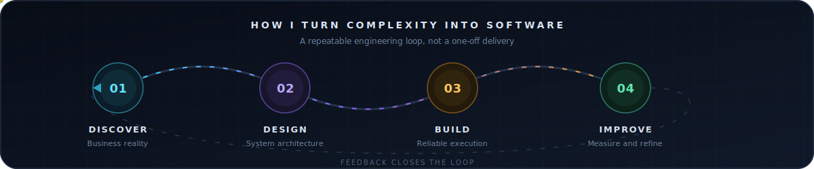

  

  

    
    
    
  

## About me

I am a full-stack developer focused on turning business requirements into reliable, maintainable web applications. My primary interests are ERP systems, backend architecture, responsive interfaces, and real-time application features.

- 💼 Working at **Logic Software Ltd.**
- 🧩 Building **ERP modules, REST APIs, and business workflows**
- ⚡ Focused on **performance, scalability, and clean implementation**
- 🌱 Continuously improving across the **Laravel and JavaScript ecosystems**
- 📍 Based in **Bangladesh**

## Engineering approach

## What I work with

  

   
   

  
  
  
  

## Selected work

  
  
  
  

## GitHub insights

  
  

  

## Let's build something useful

I am interested in practical collaborations involving ERP platforms, business automation, APIs, and modern web applications.

  

  Designed with intent. Engineered for clarity.

